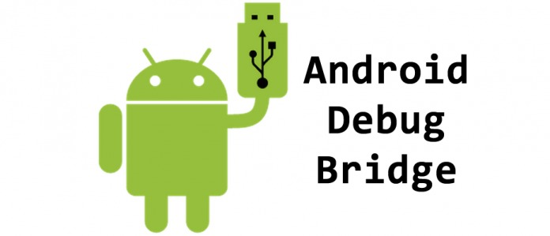

# Android Bash Profile and Terminal Tricks



<!-- more -->

## Android Debug Bridge (ADB)

Before you can do anything in your bash terminal with Android, you must install the [Android Debug Bridget(ADB)](https://developer.android.com/studio/command-line/adb). This is a set of command line tools that help you interface with Android devices

## Installing ADB

To install ADB on Mac, Windows, or Linux. XDA has some pretty good instructions on how to do so in the following [post](https://www.xda-developers.com/install-adb-windows-macos-linux/). 

Since I am on a Mac you can utilize [Homebrew](https://brew.sh/) to install ADB with the simple command `brew install android-platform-tools` which will allow you to use the ADB command from the terminal. 

## Bash Profile 

If you are using [Oh My ZShell](https://github.com/robbyrussell/oh-my-zsh), the one plugin that can be helpful to have handy is the [adb plugin](https://github.com/ohmyzsh/ohmyzsh/tree/master/plugins/adb). Can be installed by adding `adb` to the list of plugins in the `.zshrc` file. 

* `plugins=(adb)`

Otherwise below are some useful bash functions and aliases I use on a daily basis. 

```bash
# Gradle
alias gclean='./gradlew clean'
alias gstop='./gradlew --stop'
alias lapk='ls ./build/outputs/apk'

deeplink() {
	adb shell am start -a android.intent.action.VIEW -d $1
}

#save all screenshots from android device to local folder on desktop
alias screenshots='adb-sync -R /sdcard/Pictures/Screenshots/ ~/Pictures/android-screenshots'

#take a screenshot
#snap_screen will default to name screenshot-date.png
#snap_screen "test.png" will create a screenshot with test.png as the name
snap_screen() {
  if [ $# -eq 0 ]
  then
    name="screenshot-`date -u +'%Y%m-%dT%H:%M:%SZ'`.png"
  else
    name="$1.png"
  fi
  adb shell screencap -p /sdcard/$name
  adb pull /sdcard/$name ~/Pictures/android-screenshots
  adb shell rm /sdcard/$name
  echo "save to ~/Pictures/android-screenshots/$name"
}

# Record and pull video
# If you want a specific name call screen_record <name of file>
# No name will default to screen-record-<current date/time>.mp4
screen_record(){
  if [ $# -eq 0 ]
  then
    name="screen-record-`date -u +'%Y%m-%dT%H:%M:%SZ'`.mp4"
  else
    name="$1.mp4"
  fi
  echo "Starting recording, press CTRL+C when you're done..."
  trap "echo 'Recording stopped, downloading output...'" INT
  adb shell screenrecord --size 720x1280 --verbose "/sdcard/$name"
  trap - INT
  sleep 5
  adb pull /sdcard/$name ~/Movies/android-screen-recording
  echo "$name saved to ~/Movies/android-screen-recording"
  sleep 1
  adb shell rm /sdcard/$name
  echo "$name was removed from the device"
}

enable_animations() {
  adb shell settings put global window_animation_scale 1
  adb shell settings put global transition_animation_scale 1
  adb shell settings put global animator_duration_scale 1
}

disable_animations() {
  adb shell settings put global window_animation_scale 0
  adb shell settings put global transition_animation_scale 0
  adb shell settings put global animator_duration_scale 0
}
```

## Terminal 

### Installing APK From Terminal 

```bash
adb install sample.apk
```

### Using ADB When Multiple Devices Connected

To first get the serial numbers of the devices connected to your PC, run the following adb command to print all connected Android devices. 

```bash
adb devices
```

You should see the following output: 

```bash
List of devices attached
emulator-5554	device
emulator-5556	device
```

Now you should be able to use the adb serial flag, `-s`, to specify which device to execute the command on. 

```bash
## take a screenshot and save to device
adb -s emulator-5554 shell screencap -p /sdcard/screenshot.png
```