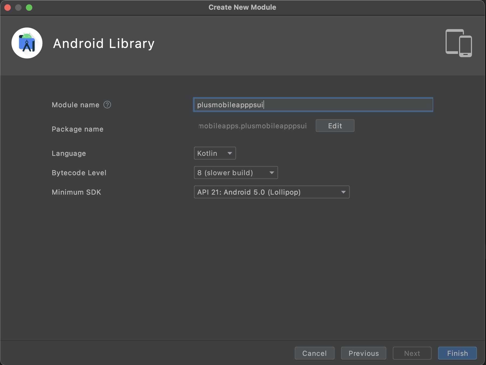
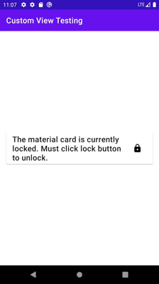
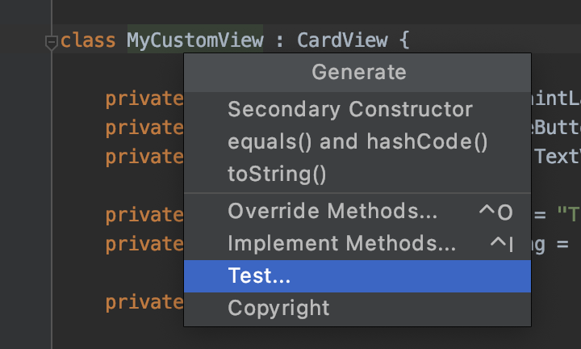
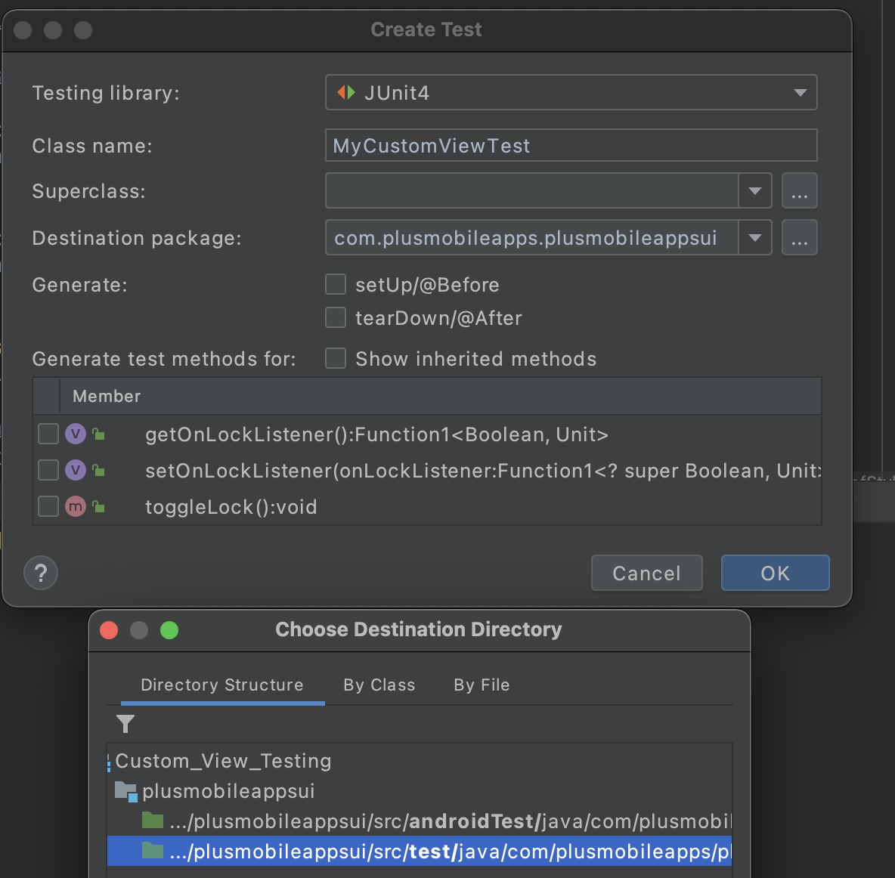

# How to test a custom Android view with Robolectric

Working at an enterprise that needs a custom component library with each component being its own snow flake and having more complicated logic than the next. I found myself needing a way to test the logic in these views to ensure I could iterate quickly and not break anything in the process. 

<!-- more -->

Having a lot of prior experience unit testing business logic at the presentation and domain layer, it was always best practice to remove all Android references as this can be very tricky to mock. So testing the logic in an Android view was somewhat foreign to me, until I came across a [medium article](https://proandroiddev.com/testing-custom-views-with-robolectric-4-bac7226f4a52) that had a very simple example of how this could be achieved with [Robolectric](http://robolectric.org) by asserting the text in `TextView`. So in this post I will try to expand on this concept with a slightly more complex example and give some tips for utilizing Kotlin to write more idiomatic tests. 

At the time this post was written, [Jetpack Compose](https://developer.android.com/jetpack/compose) was only in the alpha stage which provides a more robust solution for building and [testing](https://developer.android.com/jetpack/compose/testing) custom components. Enterprises like stable things though, so that's what this post will describe and encourage you to check out compose if it is stable or you want to be on the bleeding edge of technology. 
{:.warning}

## Create a Components Library

If you don't plan on splitting up your custom components into a separate module, then skip ahead to the next section. If you are wanting to achieve separation of concerns and encapsulate the dependencies of your custom views, then we will need to create a new library module. 

You can create a new module under `File -> New -> New Module...` and select Android library. Give the module a name and select finish. 



Then in the `app/build.gradle`, you will need to add this module to the dependencies so that custom view can be accessed from the Android app module. 

```gradle
dependencies {
    implementation project(':plusmobileappsui')
}
```

Everything else should have been auto generated when you created the library module and can move onto making the custom view. All the work for this section can be found in this [commit](https://github.com/plusmobileapps/test-custom-android-view/commit/68fd4075bae5de4c758d51aff2627c215f014802).


## Create a Custom Android View 

The component that will be built is a material card which has a lock button, text description, and a background ripple that is only active when the card is unlocked. 



I am not going to go into great detail of how this custom view itself was built to focus more on the testing side of the view. The official Android documentation has a great tutorial for [how to create a custom Android view](https://developer.android.com/training/custom-views/create-view) if you want to learn more about how to do that. Otherwise you can see all the code needed for creating this custom view in this [commit](https://github.com/plusmobileapps/test-custom-android-view/commit/0bce65404694984c247553b299912554306fdbf0). Only useful things to know for testing later is the name of the view, `MyCustomView`, and the xml attributes as we will be injecting them into the constructor of the Robolectric tests. 

```xml
<resources>
     <declare-styleable name="MyCustomView">
         <attr name="isLocked" format="boolean" />
         <attr name="unlockLabel" format="string"/>
         <attr name="lockLabel" format="string"/>
     </declare-styleable>
 </resources>
```

## Writing Robolectric Tests 

### Setup Robolectric in Project

In the module where your custom view is, add the following to the `build.gradle` in order to run Robolectric tests. 

```gradle
android {
  testOptions {
    unitTests {
      includeAndroidResources = true
    }
  }
}

dependencies {
  testImplementation 'org.robolectric:robolectric:4.4'
}
```

### Setup Robolectric Test

The quickest way to create a test is opening up `MyCustomView`, pressing `ctrl + enter` to bring up the `Generate` menu and select `Test..`. 



Android studio should auto generate the name, click on finish and make sure to select the `test` folder and not the `androidTest` folder since Robolectric can run locally on your machine. 



Now in our test class, we need to annotate our test with the Robolectric test runner and can create a setup function to instantiate the view with the context of an `Activity` from Robolectric. 

```kotlin
@RunWith(RobolectricTestRunner::class)
@Config(sdk = [Build.VERSION_CODES.O_MR1]) //needed unless you run your tests with java 9
class MyCustomViewTest {

    private lateinit var myCustomView: MyCustomView
    private lateinit var rootView: ConstraintLayout
    private lateinit var lockButton: ImageButton
    private lateinit var lockDescription: TextView

    @Before
    fun setUp() {
        val activityController = Robolectric.buildActivity(Activity::class.java)
        val activity = activityController.get()
        myCustomView = MyCustomView(activity, attributeSet)
        rootView = myCustomView.findViewById(R.id.custom_view_root)
        lockButton = myCustomView.findViewById(R.id.lock_button)
        lockDescription = myCustomView.findViewById(R.id.lock_status_description)
    }

 }
```

### Assert Text on TextViews

Asserting text on `TextView`'s is pretty straight forward by just using Junit's basics `assertEquals`. Writing an extension function on `TextView` itself will also help writing this assertion more fluently. 

```kotlin
fun TextView.assertText(expected: String) {
   assertEquals(expected, this.text)
}

@Test
fun `check lock text description`() {
    lockDescription.assertText("Some expected text")
}
```

### Assert Image Drawables

Lets write a simple test now that will just assert a specific drawable is set on the `ImageButton` in our custom view as this is supposed to change when it is toggled. Robolectric has a function that will allow us to to check the resource id that a drawable was created from called `shadowOf(yourDrawable).createdFromResId`. 

```kotlin
@Test
fun `check default unlocked state of image button`() {
    assertEquals(R.drawable.ic_lock_open24px, shadowOf(lockButton.drawable).createdFromResId)
}
```

Since `ImageButton` extends `ImageView`, we can write another extension function on `ImageView` to clean up the syntax for asserting an image drawable on the lock button. 

```kotlin
fun ImageView.assertDrawableResource(@DrawableRes expected: Int) {
    assertEquals(expected, shadowOf(this.drawable).createdFromResId)
}

@Test
fun `check default unlocked state of image button`() {
    lockButton.assertDrawableResource(R.drawable.ic_lock_24px)
}
```

### Pass Custom Attributes to View

Robolectric has an `AttributeSetBuilder` that we can add our custom view attributes to and  pass as the second argument to the view's constructor. We will get rid of the `@Before` annotation on our setup function and will call this manually before each test so the initial default locked state can be configured for each test. 

```kotlin
    private val expectedUnlockText = "some unlock text"
    private val expectedLockText = "some locked text"

    private fun setUp(isLocked: Boolean) {
        ...
        val attributeSet = with(Robolectric.buildAttributeSet()) {
            addAttribute(R.attr.unlockLabel, expectedUnlockText)
            addAttribute(R.attr.lockLabel, expectedLockText)
            addAttribute(R.attr.isLocked, isLocked.toString())
            build()
        }
        myCustomView = MyCustomView(activity, attributeSet)
    }

    @Test
    fun `toggle lock - should be locked`() {
        setUp(isLocked = false)
        myCustomView.toggleLock()
        lockDescription.assertText(expectedLockText)
        lockButton.assertDrawableResource(R.drawable.ic_lock_24px)
    }
```

One trick to clean up the builder function is to create our own function that has a parameter which is a function with a receiver. This will allow any attributes to be applied to the builder before building the `AttributeSet` avoiding the need to ever call the `build()` function directly in tests.  

```kotlin
fun buildAttributeSet(attrs: AttributeSetBuilder.() -> Unit): AttributeSet {
    return with(Robolectric.buildAttributeSet()) {
        attrs()
        build()
    }
}

private fun setUp(isLocked: Boolean) {
    val attributeSet = buildAttributeSet {
        addAttribute(R.attr.unlockLabel, expectedUnlockText)
        addAttribute(R.attr.lockLabel, expectedLockText)
        addAttribute(R.attr.isLocked, isLocked.toString())
    }
    myCustomView = MyCustomView(activity, attributeSet)
}
```

### Testing View Listeners 

Most views have some kind of listener when states are changed and in the instance of `MyCustomView`, it has a listener that is triggered when ever the user changes the lock state. So in order to write this kind of test, a mocking library is needed and we will use [Mockk](https://mockk.io) to make these verifications. 

Add Mockk to your module's dependencies: 

```gradle
dependencies {
    testImplementation "io.mockk:mockk:1.10.3-jdk8"
}
```

Create a mocked lambda in the test and have it return `Unit` anytime it is invoked in our `setup()` function. Then you can set the listener on the custom view and write the toggle listener test. 

```kotlin
    private val lockedListener: (Boolean) -> Unit = mockk()

    private fun setUp(isLocked: Boolean) {
        every { lockedListener(any()) } returns Unit

        myCustomView.onLockListener = lockedListener
    }

    @Test
    fun `lock listener invoked - initial false then toggled to true`() {
        setUp(isLocked = false)

        myCustomView.toggleLock()

        verify { lockedListener(true) }
    }
```

### Testing Background Drawables 

One requirement that was set for this custom view is that when the view is locked it should only be unlocked by clicking on the lock button itself and not whole card. This can be achieved by removing the ripple on the background drawable to indicate to the user it is not clickable and verifying that our toggle listener is not invoked with Mockk. 

```kotlin
fun View.assertBackground(@DrawableRes expected: Int) {
    assertEquals(expected, shadowOf(this.background).createdFromResId)
}

    @Test
    fun `root shouldn't have ripple when locked and only unlock with image button`() {
        setUp(isLocked = true)

        myCustomView.performClick()
        lockButton.assertDrawableResource(R.drawable.ic_lock_24px)
        rootView.assertBackground(android.R.color.white)
        verify(exactly = 0) { lockedListener(any()) }

        lockButton.performClick()
        rootView.assertBackground(R.drawable.my_custom_ripple)
        lockButton.assertDrawableResource(R.drawable.ic_lock_open_24px)
        verify { lockedListener(false) }

        myCustomView.performClick()
        rootView.assertBackground(android.R.color.white)
        lockButton.assertDrawableResource(R.drawable.ic_lock_24px)
        verify { lockedListener(true) }
    }
```

### Passing Drawables through AttributeSet

This would probably be overkill for this custom view, but if you ever wanted to pass any drawable resource through the custom view attributes I thought it would be worth mentioning how to do this as it may help generalize how to pass anything through the `AttributeSetBuilder`. First add the new attributes to the custom view styleable and use the attributes on `MyCustomView`.   

```xml
<resources>
    <declare-styleable name="MyCustomView">
        <attr name="lockedIcon" format="reference"/>
        <attr name="unlockedIcon" format="reference"/>
    </declare-styleable>
</resources>
```

```xml
    <com.plusmobileapps.plusmobileappsui.MyCustomView
        ...
        app:lockedIcon="@drawable/ic_lock_24px"
        app:unlockedIcon="@drawable/ic_lock_open_24px" />
```

Since the only value that can be added as an attribute to the builder is a string, you actually need to pass the exact string used to declare the drawable used in the custom view declaration. 

```kotlin
val attributeSet = buildAttributeSet { 
    addAttribute(R.attr.lockedIcon, "@drawable/ic_lock_24px")
    addAttribute(R.attr.unlockedIcon, "@drawable/ic_lock_open_24px")
}
```

So as a general rule of thumb, anything that needs to be added to the builder is the exact string you would use if you were to declare it in xml. 

All of the work needed to add this functionality can be found in this [commit](https://github.com/plusmobileapps/test-custom-android-view/commit/fb84c862fa22825795e12b8df82cfe221526aa03).

## Conclusion

As we come to the end of this post, I hope you learned how to use Robolectric to unit test the logic in a custom Android view in a variety of different scenarios. Robolectric is a great tool in any Android developers tool set unlocking the ability to test Android locally on your machine without needing to run a slow instrumented test with Espresso. There are a lot of other things Robolectric can be used for when testing Android and we just touched the tip of the iceberg in this post. So I encourage you to explore the [`Robolectric`](https://github.com/robolectric/robolectric/blob/master/robolectric/src/main/java/org/robolectric/Robolectric.java) class to see what else is possible. Happy coding!

## Source code

* [Github Repository](https://github.com/plusmobileapps/test-custom-android-view) 
* [`MyCustomViewTest`](https://github.com/plusmobileapps/test-custom-android-view/blob/master/plusmobileappsui/src/test/java/com/plusmobileapps/plusmobileappsui/MyCustomViewTest.kt)
* [`MyCustomView`](https://github.com/plusmobileapps/test-custom-android-view/blob/master/plusmobileappsui/src/main/java/com/plusmobileapps/plusmobileappsui/MyCustomView.kt) 
