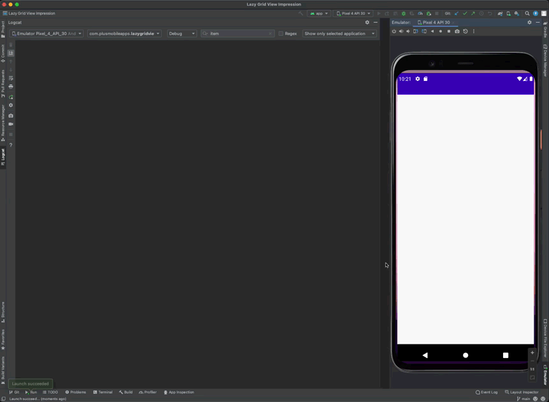

# How to track view impressions in a Jetpack Compose Lazy Column


If you have ever shipped a feature with a scrolling list, a product manager will usually ask you to track when an item in that list is viewed by the user. With Jetpack Compose being somewhat new, I was curious how to solve this problem with respect to a `LazyColumn` so let's learn how to know the second eyeballs see items as they scroll into view!


<!-- more -->

## Build the UI 

The data model for the list will be a very simple data class that has a `key` property which will be important for use with the `LazyColumn` to know exactly which items are coming into view. The `key` can technically be `Any` type, the important thing is to ensure there is an `equals` method on whatever type you choose so for simplicity in this example we will make it a `String`. 

```kotlin
data class Person(val key: String, val name: String)
```

To start off building the UI for this sample, we will start with a `LazyColumn` lifting the `LazyListState` up as this will become important later to calculate exactly which items are scrolling into view. The other important callout here is declaring the key for the items in the `LazyColumn` by passing in the `key` property on a `Person` discussed earlier. Finally, pass the lazy list state down into each item in the list. 

```kotlin
@Composable
fun ListView(
    people: List<Person>,
    onDeleteClicked: (Person) -> Unit,
    onItemViewed: (Person) -> Unit
) {
    val lazyListState = rememberLazyListState() // lift the lazy list state
    LazyColumn(state = lazyListState) {
        items(people.size, key = { people[it].key }) { // declare the key for item
            val person = people[it]
            PersonRow(lazyListState, person, onDeleteClicked, onItemViewed) // pass lazy list state into item
        }
    }
}
```

Now looking at the `PersonRow` composable, we will make use of an `ItemImpression` composable passing in the lazy list state as this will be where the logic for knowing when this item was scrolled into view. 

```kotlin
@Composable
fun PersonRow(lazyListState: LazyListState, person: Person, onDeleteClicked: (Person) -> Unit, onItemViewed: (Person) -> Unit) {
    ItemImpression(key = person.key, lazyListState = lazyListState) {
        onItemViewed(person)
    }
    // omitted UI code for row 
}
```

Now the `ItemImpression` composable technically doesn't have any UI related code in it as its really just concerned with determining when a specific `key` has scrolled into view of the `LazyListState`. However, we will make use of [`derivedStateOf`](https://developer.android.com/reference/kotlin/androidx/compose/runtime/package-summary#derivedStateOf(kotlin.Function0)) in Compose to ensure that the `isItemWithKeyInView` is calculated when the state of the `lazyListState` changes, but will only cause recomposition when the value of the derived state changes. Then the [`LaunchedEffect`](https://developer.android.com/jetpack/compose/side-effects#launchedeffect) will fire exactly one time since `Unit` is being passed in as the key which notifies when the item was viewed. 

```kotlin
@Composable
fun ItemImpression(key: Any, lazyListState: LazyListState, onItemViewed: () -> Unit) {
    val isItemWithKeyInView by remember {
        derivedStateOf {
            lazyListState.layoutInfo
                .visibleItemsInfo
                .any { it.key == key }
        }
    }
    if (isItemWithKeyInView) {
        LaunchedEffect(Unit) { onItemViewed() }
    }
}
```

## Analytics Tracker 

With the compose code written so far, this will notify when an item is scrolled into view. However, it will notify when an item is not just scrolled from the bottom into view but also being scrolled back into view from the top. Most product managers probably only care to know that an item was viewed once, which is pretty easy to ensure by making use of a `HashSet` and checking if that key exists in the `HashSet` before determining if the impression analytics event should be fired. 

```kotlin
class AnalyticsTracker {

    private val recordedPeople = hashSetOf<String>()

    fun onPersonViewed(person: Person) {
        if (recordedPeople.contains(person.key)) return
        recordedPeople.add(person.key)
        Log.d("Item Impression", person.toString())
    }
}
```

## ViewModel

One of the last things to glue everything together is making a `ViewModel` to delegate events to the tracker for view impressions of items and manage the state of the list. Note for simplicity the tracker is just instantiated in the `ViewModel`, in a production project one would inject this dependency with your dependency injection framework of choice. I didn't want to over complicate this sample with a DI framework though. 

```kotlin
class MainViewModel : ViewModel() {

    private val tracker = AnalyticsTracker()

    private var _state: MutableStateFlow<List<Person>> = MutableStateFlow(people)
    val state: StateFlow<List<Person>> get() = _state

    fun onDeleteClicked(person: Person) {
        _state.value = _state.value.toMutableList().also { it.remove(person) }
    }

    fun onPersonViewed(person: Person) {
        tracker.onPersonViewed(person)
    }
}
```

## Final Outcome 



That's it! If you want to look at complete source code for this sample, it is linked in the section below. Hope this helps and don't be afraid to leave a comment!

## Resources 

* [Github Repository](https://github.com/plusmobileapps/lazycolumn-view-impressions)
* [Stack Overflow Answer](https://stackoverflow.com/a/70951303/7900721) - an efficient way to check when a specific LazyColumn item comes into view