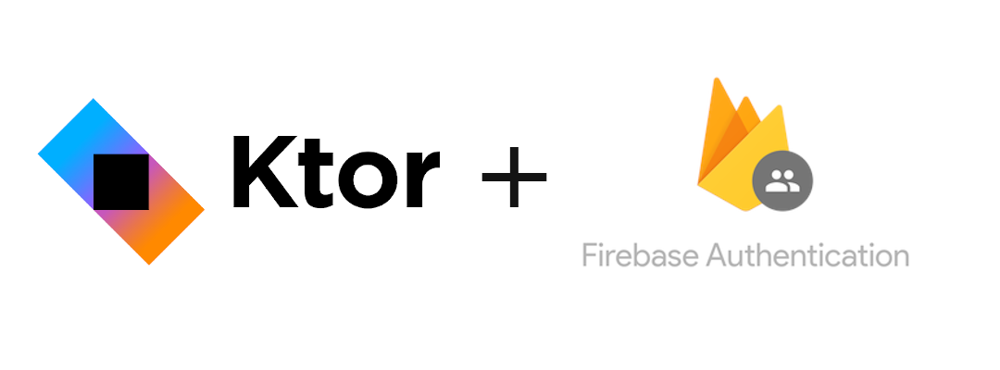
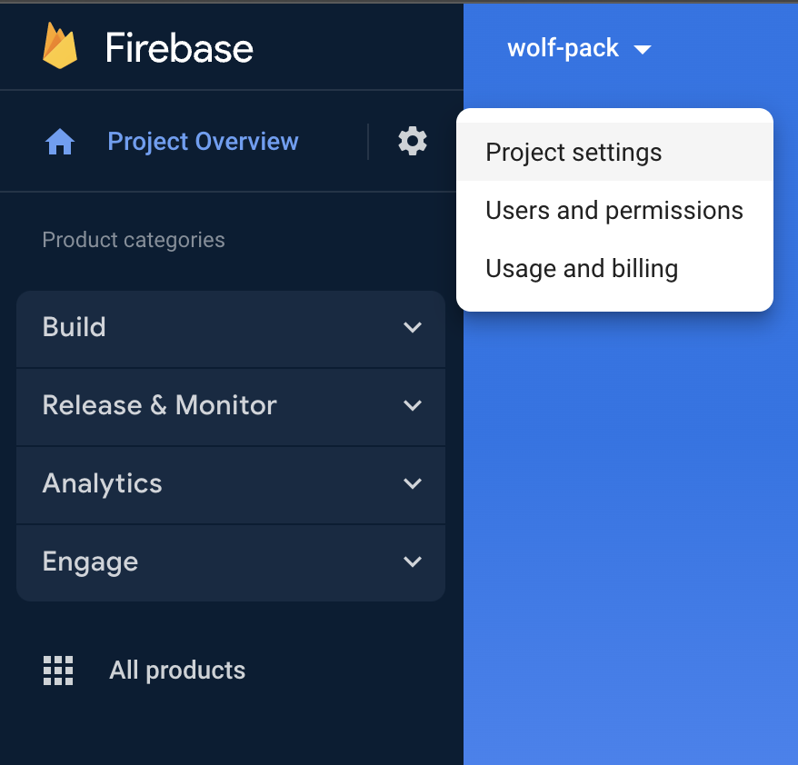
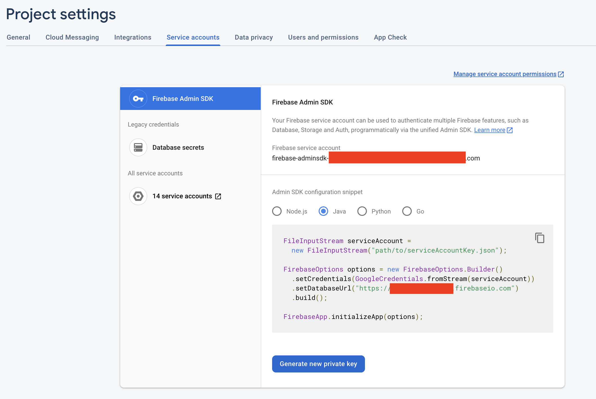

# How to use Firebase Authentication with Ktor 2.0



With the release of Ktor 2.0, one of the migrations I had to do was for Firebase Authentication which I first learned about how to use with Ktor 1.6 from this [medium article](https://levelup.gitconnected.com/how-to-integrate-firebase-authentication-with-ktors-auth-feature-dc2c3893a0cc) last year. Learn how to setup Firebase Authentication with Ktor 2.0 and how to test it. 

<!-- more -->

## Project Setup 

### Firebase Project Setup

Before downloading the starter project, follow these [instructions](https://cloud.google.com/firestore/docs/client/get-firebase) to create a new firebase project and enable authentication. Then click on the settings button in the side bar -> project settings -> service accounts tab -> generate a new private key which should then download a JSON file to your machine. 





### Download and Configure Project

Then download the [Ktor Project Template](https://start.ktor.io#/settings?name=ktor-firebase-admin-sample&website=plusmobileapps.com&artifact=com.plusmobileapps.ktor-firebase-admin-sample&kotlinVersion=1.7.10&ktorVersion=2.0.3&buildSystem=GRADLE_KTS&engine=NETTY&configurationIn=CODE&addSampleCode=true&plugins=content-negotiation%2Crouting%2Ckotlinx-serialization%2Cauth) from the Ktor Project Generator site. It will setup Ktor with 2.0.3 and the following plugins:

* Authentication
* Content Negotiation
* kotlinx.serialization
* Routing

Now with the JSON file downloaded from the service account creation, rename this file to `ktor-firebase-auth-adminsdk.json` and move it into this project under `src/main/resources/ktor-firebase-auth-adminsdk.json`

The service account JSON configuration should not be checked into your git repository as this should be kept secret. To prevent this, add the file `src/main/resources/ktor-firebase-auth-adminsdk.json` to your `.gitignore` file. 
{:.warning}

Finally add the [Firebase Admin Java SDK](https://firebase.google.com/docs/admin/setup#add-sdk) to the `build.gradle.kts` file in order to user Firebase Authentication. 

```kotlin
dependencies {
    implementation("com.google.firebase:firebase-admin:9.0.0")
}
```

## Setup Firebase App

With the project configured, the FirebaseApp on the server must be initialized using the service account JSON file placed in the resources folder.

```kotlin
object FirebaseAdmin {
    private val serviceAccount: InputStream? =
        this::class.java.classLoader.getResourceAsStream("ktor-firebase-auth-adminsdk.json")

    private val options: FirebaseOptions = FirebaseOptions.builder()
        .setCredentials(GoogleCredentials.fromStream(serviceAccount))
        .build()

    fun init(): FirebaseApp = FirebaseApp.initializeApp(options)
}
```

Then simply call the `init()` function when the server is first started. 

```kotlin
fun main() {
    embeddedServer(Netty, port = 8080, host = "0.0.0.0") {
        FirebaseAdmin.init()
        // configure rest of project
    }.start(wait = true)
}
```

Now the Firebase Admin SDK is ready to use and we will learn to configure a Ktor authentication plugin to work with Firebase Authentication. 

## Setup Firebase Authentication

With the Firebase Admin SDK initialized, it is time to create a [Ktor Authentication Provider](https://ktor.io/docs/authentication.html) that can verify the JSON web token(JWT) from incoming requests are from an authenticated Firebase user.  

### Create a Principal

First create a simple data class called `User` which will have some basic properties to represent a Firebase user, note how this extends the `Principal` interface to indicate to Ktor this class represents an authenticated principal. Feel free to add more properties to this file that fit your needs of what represents a user in your application. 

```kotlin
data class User(val userId: String = "", val displayName: String = "") : Principal
```

### Create AuthenticationProvider

Now a Ktor `AuthenticationProvider` can be created which will verify the incoming request's JWT and set the principal on the request to the current `User` if they are unauthenticated. I will have to credit [Aleksei Tirman for the inspiration for this solution](https://stackoverflow.com/a/72446067/7900721), although I did make a couple small tweaks to improve the error messaging and will try to break it down. 

First create a `FirebaseConfig` class that extends `AuthenticationProvider.Config` which will provide a lambda to convert a Ktor Request and verified `FirebaseToken` to the `User` class. 

```kotlin
class FirebaseConfig(name: String?) : AuthenticationProvider.Config(name) {
    internal var authHeader: (ApplicationCall) -> HttpAuthHeader? =
        { call -> call.request.parseAuthorizationHeaderOrNull() }

    var firebaseAuthenticationFunction: AuthenticationFunction<FirebaseToken> = {
        throw NotImplementedError(FirebaseImplementationError)
    }

    fun validate(validate: suspend ApplicationCall.(FirebaseToken) -> User?) {
        firebaseAuthenticationFunction = validate
    }
}

fun ApplicationRequest.parseAuthorizationHeaderOrNull(): HttpAuthHeader? = try {
    parseAuthorizationHeader()
} catch (ex: IllegalArgumentException) {
    println("failed to parse token")
    null
}

private const val FirebaseImplementationError =
    "Firebase  auth validate function is not specified, use firebase { validate { ... } } to fix this"
```

Now create the `FirebaseAuthProvider` class and extend the `AuthenticationProvider`. Here is where the bulk of the logic doing the verification with the Firebase Authentication will happen and set the `User` as the principal if the user request is authenticated. 

```kotlin

class FirebaseAuthProvider(config: FirebaseConfig) : AuthenticationProvider(config) {
    val authHeader: (ApplicationCall) -> HttpAuthHeader? = config.authHeader
    private val authFunction = config.firebaseAuthenticationFunction

    override suspend fun onAuthenticate(context: AuthenticationContext) {
        val token = authHeader(context.call)

        if (token == null) {
            context.challenge(
                FirebaseJWTAuthKey,
                AuthenticationFailedCause.InvalidCredentials
            ) { challengeFunc, call ->
                challengeFunc.complete()
                call.respond(UnauthorizedResponse(HttpAuthHeader.bearerAuthChallenge(realm = FIREBASE_AUTH)))
            }
            return
        }

        try {
            val principal = verifyFirebaseIdToken(context.call, token, authFunction)

            if (principal != null) {
                context.principal(principal)
            }
        } catch (cause: Throwable) {
            val message = cause.message ?: cause.javaClass.simpleName
            context.error(FirebaseJWTAuthKey, AuthenticationFailedCause.Error(message))
        }
    }
}

suspend fun verifyFirebaseIdToken(
    call: ApplicationCall,
    authHeader: HttpAuthHeader,
    tokenData: suspend ApplicationCall.(FirebaseToken) -> Principal?
): Principal? {
    val token: FirebaseToken = try {
        if (authHeader.authScheme == "Bearer" && authHeader is HttpAuthHeader.Single) {
            withContext(Dispatchers.IO) {
                FirebaseAuth.getInstance().verifyIdToken(authHeader.blob)
            }
        } else {
            null
        }
    } catch (ex: Exception) {
        ex.printStackTrace()
        return null
    } ?: return null
    return tokenData(call, token)
}

fun HttpAuthHeader.Companion.bearerAuthChallenge(realm: String): HttpAuthHeader =
    HttpAuthHeader.Parameterized("Bearer", mapOf(HttpAuthHeader.Parameters.Realm to realm))

const val FIREBASE_AUTH = "FIREBASE_AUTH"
const val FirebaseJWTAuthKey: String = "FirebaseAuth"
```

Finally create an extension function on `AuthenticationConfig` which will create an instance of the `FirebaseAuthProvider` and register it to the Ktor application. 

```kotlin
fun AuthenticationConfig.firebase(
    name: String? = FIREBASE_AUTH,
    configure: FirebaseConfig.() -> Unit
) {
    val provider = FirebaseAuthProvider(FirebaseConfig(name).apply(configure))
    register(provider)
}
```

### Install Authentication Plugin

The `firebase()` extension function can now be used when installing the `Authentication` plugin on the Ktor `Application`. The `validate {}` lambda is where any additional information of a user could be looked up that does not exist on a `FirebaseToken` object. 

```kotlin
fun Application.configureFirebaseAuth() {
    install(Authentication) {
        firebase {
            validate {
                // TODO look up user profile from DB
                User(it.uid, it.name.orEmpty())
            }
        }
    }
}
```

Now call this extenstion function after the `FirebaseAdmin.init()` function to complete the integration. 

```kotlin
fun main() {
    embeddedServer(Netty, port = 8080, host = "0.0.0.0") {
        FirebaseAdmin.init()
        configureFirebaseAuth()
    }.start(wait = true)
}
```

### Create Authenticated Route

Now with Firebase Authentication configured in the Ktor project, authenticated routes can be made using the same `FIREBASE_AUTH` constant that was used to register the plugin. Simply wrap any `Route` with `authenticate(FIREBASE_AUTH) { }`. If the user's request has an invalid/expired JWT in the original request, the route should respond with an unauthorized 401 http status. 

```kotlin
fun Route.authenticatedRoute() {
    authenticate(FIREBASE_AUTH) {
        get("/authenticated") {
            val user: User =
                call.principal() ?: return@get call.respond(HttpStatusCode.Unauthorized)
            call.respond("User is authenticated: $user")
        }
    }
}
```

## Testing 

### Manual Testing

To manually test the Firebase integration, you will need to get a valid JWT to send to the server in the authorization header. You may retrieve one the [sign up](https://firebase.google.com/docs/reference/rest/auth#section-create-email-password) or [sign in](https://firebase.google.com/docs/reference/rest/auth#section-sign-in-email-password) Firebase restful API. The example curl request below will make the sign up request, replace `insert-api-key` with your Firebase web api key which can be found in the Firebase Console under Project Settings. 

```bash
curl --location --request POST 'https://identitytoolkit.googleapis.com/v1/accounts:signUp?key=insert-api-key' \
--header 'Content-Type: application/json' \
--data-raw '{
    "email" : "test@plusmobileapps.com",
    "password" : "Password123!",
    "returnSecureToken" : true
}'
```

This should return a JSON object and you will need the `idToken` property for authenticated requests later. 

```json
{
    "idToken": "extract this token value"
}
```

Now you can make the request to your server injecting the token from the last step as the bearer for authentication. 

```bash
curl --location --request GET 'http://0.0.0.0:8080/authenticated' \
--header 'Authorization: Bearer insert-token-value'

"User is authenticated: User(userId=some-user-id, displayName=Andrew)"
```

### Unit Testing Authenticated Routes

To write unit tests for an authenticated route, we will create a `FirebaseAuthTestProvider` which will allow a mocked `User` to be provided and set as the principal. 

```kotlin
class FirebaseAuthTestProvider(config: FirebaseTestConfig) : AuthenticationProvider(config) {

    private val authFunction: () -> User? = config.mockAuthProvider

    override suspend fun onAuthenticate(context: AuthenticationContext) {
        val mockUser: User? = authFunction()
        if (mockUser != null) {
            context.principal(mockUser)
        } else {
            context.error(
                FirebaseJWTAuthKey,
                AuthenticationFailedCause.Error("User was mocked to be unauthenticated")
            )
        }
    }
}

class FirebaseTestConfig(name: String?) : AuthenticationProvider.Config(name) {

    var mockAuthProvider: () -> User? = { null }

}
```

Then create an extension function on `ApplicationTestBuilder` that will install the authentication plugin and register the `FirebaseAuthTestProvider`. 

```kotlin
val defaultTestUser = User(userId = "some-user-id", displayName = "Darth Vader")

fun ApplicationTestBuilder.mockAuthentication(mockAuth: () -> User? = { defaultTestUser }) {
    install(Authentication) {
        val provider = FirebaseAuthTestProvider(FirebaseTestConfig(FIREBASE_AUTH).apply {
            mockAuthProvider = mockAuth
        })
        register(provider)
    }
}
```

### Create a Ktor Test

To write a [Ktor test](https://ktor.io/docs/testing.html) for an authenticated route, make use of the newly created `mockAuthentication { }` function, install the authenticated route under test, and call it with the client. 

```kotlin
class AuthenticatedRouteTest {
    @Test
    fun `authenticated route - is authenticated`() = testApplication {
        val user = User("some id", "Andrew")
        mockAuthentication { user }
        routing { authenticatedRoute() }

        client.get("/authenticated").apply {
            assertEquals(HttpStatusCode.OK, status)
            assertEquals("User is authenticated: $user", bodyAsText())
        }
    }
}
```

Also worth mentioning since the `mockAuth` function parameter defaults to returning the `defaultTestUser`, this authenticated test could also be rewritten like so: 

```kotlin
@Test
fun `authenticated route - is authenticated`() = testApplication {
    mockAuthentication()
    routing { authenticatedRoute() }

    client.get("/authenticated").apply {
        assertEquals(HttpStatusCode.OK, status)
        assertEquals("User is authenticated: $defaultTestUser", bodyAsText())
    }
}
```

If you were so inclined to test an unauthorized user, simply return null in the `mockAuthentication { }` lambda. 

```kotlin
@Test
fun `authenticated route - is unauthorized`() = testApplication {
    mockAuthentication { null }
    routing { authenticatedRoute() }

    client.get("/authenticated").apply {
        assertEquals(HttpStatusCode.Unauthorized, status)
    }
}
```

## Conclusion

At this point, you should have a Ktor server configured with Firebase authentication and learned how to write Ktor tests with a Firebase test authentication provider. If you wish to see all the source code for this project please check out the link below. Happy coding! 

## Resources

* [Github Repository - Source Code](https://github.com/plusmobileapps/ktor-firebase-auth-sample)